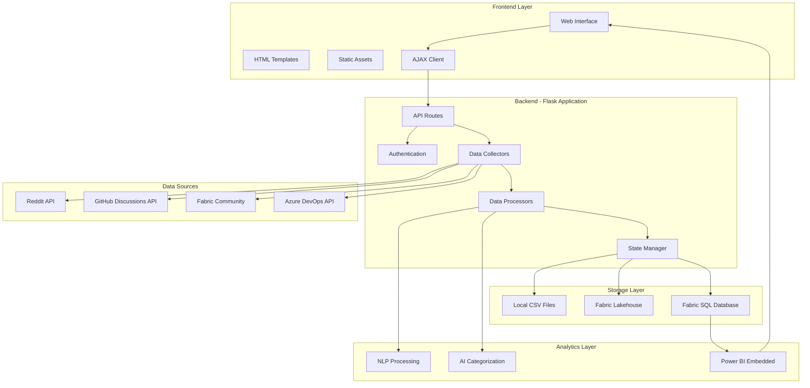

# Microsoft Fabric Workloads Feedback Collector

A comprehensive, enterprise-grade web-based tool that intelligently collects, processes, and manages feedback about Microsoft Fabric Workloads from multiple sources. Features advanced categorization, state management, and seamless integration with Microsoft Fabric SQL Database and Lakehouse for analytics.

## 🌟 Key Features

### **Multi-Source Data Collection**
- **Reddit**: r/MicrosoftFabric community discussions with real-time monitoring
- **Microsoft Fabric Community**: Official forums and discussions
- **GitHub Discussions**: Microsoft-Fabric-workload-development-sample repository
- **Azure DevOps**: Work items and task feedback with advanced text cleaning

### **Advanced Intelligence & Processing**
- **Domain-Aware Categorization**: Maps feedback to 6 cross-cutting business domains
- **Smart Audience Detection**: Automatically identifies Developer/Customer/ISV feedback
- **Enhanced Text Processing**: Removes CSS, HTML, and email content from ADO items
- **Duplicate Detection**: Identifies repeating requests with 30% similarity threshold
- **Priority Classification**: Automatic priority assignment based on content analysis
- **Confidence Scoring**: Provides categorization confidence levels
- **State Management**: Tracks feedback lifecycle and user interactions

### **Enterprise Web Interface**
- **Modern Web UI**: Bootstrap-powered responsive interface with real-time updates
- **Enhanced Feedback Viewer**: Advanced filtering by category, audience, domain, and priority
- **Interactive State Management**: Users can update feedback status and add comments
- **Statistical Insights**: Comprehensive analytics with cross-tabulation matrices
- **Progress Drawer**: Real-time collection monitoring with detailed logging
- **Token Management**: Secure Bearer token handling for Fabric integration

### **Microsoft Fabric Integration**
- **SQL Database Integration**: Direct connection to Fabric SQL Database for state persistence
- **Lakehouse Writing**: Seamless integration with Fabric Lakehouse for analytics
- **Async Operations**: Non-blocking data transfers with progress monitoring
- **Bearer Token Authentication**: Secure API access management with user context
- **Power BI Integration**: Ready-to-use analytics dashboard

### **🆕 Recent Enhancements (v4.1)**
- **Fixed Progress Bar Reset Issues**: Progress bars now properly reset to 0 when starting new collections
- **Resolved Spinner State Management**: Collection completion properly stops all progress indicators
- **Enhanced Stale Data Guards**: Improved detection and filtering of outdated progress data
- **Fixed Mode Detection**: Offline/Online mode detection now works correctly on feedback page
- **Resolved JSON Parsing Errors**: NaN values are properly handled in data serialization
- **Improved Session State Management**: Better handling of Fabric connection states
- **Enhanced Error Handling**: More robust error handling for data collection and UI updates

## 🛠️ Prerequisites

- **Python 3.8+**
- **Microsoft SQL Server ODBC Driver** (18, 17, 13, or Native Client 11.0)
- **API Credentials**:
  - Reddit API (client_id, client_secret, user_agent)
  - GitHub Personal Access Token (repo scope)
  - Azure DevOps PAT (Work Items Read scope)
- **Microsoft Fabric Access**: 
  - Bearer token for Lakehouse and SQL Database operations
  - SQL Database connection permissions
- **Azure AD Authentication**: Interactive authentication for development environments

## 🚀 Quick Start

### Web Application (Development)

#### 1. **Installation**
```bash
git clone [repository-url]
cd FeedbackCollector
pip install -r src/requirements.txt
```

#### 2. **ODBC Driver Setup**
Ensure you have one of the supported ODBC drivers installed:
- ODBC Driver 18 for SQL Server (recommended)
- ODBC Driver 17 for SQL Server
- ODBC Driver 13 for SQL Server
- SQL Server Native Client 11.0

#### 3. **Environment Setup**
```bash
cp src/.env.template src/.env
# Edit src/.env with your API credentials
```

#### 4. **Launch Web Interface**
```bash
cd src
python run_web.py
```

#### 5. **Access Application**
- Open browser to `http://localhost:5000`
- Authenticate with your Bearer token
- Start collecting feedback with real-time progress tracking
- View and manage feedback at `/feedback` endpoint with state management
- Access Power BI insights at `/insights` endpoint

---

### 💻 Windows Desktop Application

**NEW**: Standalone Windows executable - no Python installation required!

#### Quick Start
1. Download the portable application package
2. Extract to any folder (e.g., `C:\FeedbackCollector\`)
3. **Configure API credentials** (see setup below)
4. Double-click `FeedbackCollector.exe`
5. Browser opens automatically to `http://localhost:5000`

#### First-Time Setup (Required)
Before collecting feedback, you **must** configure API credentials:

1. **Navigate to the application folder**
   ```powershell
   cd path\to\FeedbackCollector
   ```

2. **Create configuration file**
   ```powershell
   Copy-Item .env.example -Destination .env
   ```

3. **Edit `.env` with your API credentials:**
   - **Reddit API**: Get from https://www.reddit.com/prefs/apps
   - **GitHub Token**: Get from https://github.com/settings/tokens
   - (Optional) Azure DevOps PAT
   - (Optional) Microsoft Fabric configuration

4. **Restart the application**

#### Features
- ✅ **Standalone**: No Python installation needed
- ✅ **Portable**: Runs from any folder, no installation required
- ✅ **Auto-launch**: Browser opens automatically
- ✅ **Full-featured**: All web app capabilities included
- ✅ **Easy distribution**: Share single folder with colleagues
- ✅ **Size**: ~400MB (includes Python runtime + dependencies)

#### Distribution
To share with others:
1. ZIP the entire application folder
2. Recipients extract and configure their own `.env` file
3. No Python or dependencies needed on target PC

#### Requirements
- **Windows 10/11** (64-bit)
- **No Python required**
- **~500MB free disk space**
- **API credentials** (Reddit, GitHub)

#### Troubleshooting
- **Port 5000 in use?** Close other applications or restart PC
- **Collection fails?** Check `.env` file has valid credentials
- **Browser doesn't open?** Manually navigate to `http://localhost:5000`
- See `README.txt` inside application folder for detailed help

---

## 🏗️ Architecture Overview

The Feedback Collector follows a **client-server architecture** with clear separation between frontend and backend components, designed for enterprise-scale feedback aggregation and analysis.

### **High-Level Architecture**



### **Frontend Architecture**

#### **Components**
- **Templates** (`src/templates/`): Bootstrap 5-powered responsive interfaces
  - `index.html` - Main dashboard for keyword management and collection triggers
  - `feedback_viewer.html` - Interactive feedback viewer with filtering and state management
  - `insights_page.html` - Power BI embedded analytics dashboard

- **Static Assets** (`src/static/js/`): Dynamic client-side functionality
  - `badge-state-manager.js` - Real-time UI state management
  - `modern-filter-system.js` - Advanced filtering and search functionality

#### **Technologies**
- **Bootstrap 5** - Responsive UI framework
- **JavaScript ES6** - Dynamic interactions and AJAX calls
- **HTML5/CSS3** - Structure and styling
- **Real-time updates** - Polling for collection progress

### **Backend Architecture**

#### **Core Application Layer**
- **Flask Application** (`src/app.py`): 2,426-line main controller with RESTful API endpoints
- **Entry Point** (`src/run_web.py`): Application bootstrap and configuration
- **Session Management**: Persistent authentication state and user context tracking

#### **Data Collection Layer**
- **Multi-Source Collectors** (`src/collectors.py`):
  - `RedditCollector` - Reddit API integration using PRAW
  - `FabricCommunityCollector` - Microsoft Fabric Community scraping
  - `GitHubDiscussionsCollector` - GitHub Discussions API integration
- **Azure DevOps Integration** (`src/ado_client.py`): Work item collection with authentication

#### **Data Processing Layer**
- **NLP & Categorization** (`src/utils.py`): Sentiment analysis, content categorization, text cleaning
- **ID Generation** (`src/id_generator.py`): Deterministic feedback ID generation for deduplication
- **Configuration Management** (`src/config.py`): Hierarchical categories and domain mappings

#### **Storage & State Management**
- **Local Storage**: CSV files for backup and development
- **Fabric Integration**:
  - `fabric_writer.py` - Bulk data writes to Fabric Lakehouse
  - `fabric_sql_writer.py` - State management in Fabric SQL Database
  - `fabric_state_writer.py` - Individual state updates
- **State Manager** (`src/state_manager.py`): Feedback lifecycle and user authorization

### **Data Flow Process**

1. **Collection**: User triggers collection → Collectors gather data from multiple sources in parallel
2. **Processing**: Sentiment analysis and categorization → State initialization for new feedback
3. **Storage**: Save to CSV and optionally to Fabric → Progress tracking updates UI in real-time
4. **State Management**: User updates via web interface → Validation → Database persistence → Cache sync

### **Database Architecture**

#### **Primary Tables**
- **Feedback Table**: Main data storage with sentiment analysis, categorization, and metadata
- **FeedbackState Table**: State management with audit trail and user attribution
- **Comments System**: User notes and collaboration features

#### **Key Features**
- **ACID Compliance**: All state changes are atomic and reversible
- **Concurrent Access**: Multiple users can work on feedback simultaneously
- **Audit Trail**: Complete history of all changes with user attribution
- **Connection Resilience**: Multiple ODBC driver support with automatic fallback

### **Authentication & Security**

#### **Multi-Modal Authentication**
- **Azure AD Interactive** - Development/testing with interactive login
- **Bearer Token** - Production Fabric access with user context extraction
- **Personal Access Tokens** - External API access (GitHub, ADO)

#### **Security Features**
- Session management for persistent authentication
- Token validation and refresh mechanisms
- Input sanitization for SQL injection prevention
- Environment variable protection for sensitive credentials

## 🔧 Configuration

### **Environment Variables (.env)**
```env
# Reddit API
REDDIT_CLIENT_ID=your_client_id
REDDIT_CLIENT_SECRET=your_client_secret
REDDIT_USER_AGENT=your_user_agent

# GitHub API
GITHUB_TOKEN=your_github_token

# Azure DevOps
ADO_PAT=your_ado_personal_access_token
ADO_ORG_URL=https://dev.azure.com/your-org
ADO_PROJECT_NAME=your_project
ADO_PARENT_WORK_ITEM_ID=your_parent_item_id

# Microsoft Fabric
FABRIC_LIVY_ENDPOINT=your_fabric_livy_endpoint
FABRIC_TARGET_TABLE_NAME=your_target_table
FABRIC_WRITE_MODE=append
FABRIC_STORAGE_URL=your_storage_url
FABRIC_STORAGE_KEY=your_storage_key

# Power BI (Optional)
POWERBI_EMBED_BASE_URL=your_powerbi_url
POWERBI_REPORT_ID=your_report_id
POWERBI_TENANT_ID=your_tenant_id
```

### **Fabric SQL Database Configuration**
The application automatically connects to the Fabric SQL Database for state management:
- **Server**: `x6eps4xrq2xudenlfv6naeo3i4-cfyeshmtnhnuzlhe7juljtqiie.msit-database.fabric.microsoft.com,1433`
- **Database**: `Feedbackstate-6b85be29-3a09-4773-894f-7976ad58c8b3`
- **Authentication**: Azure AD Interactive (development) or Bearer Token (production)

### **API Credentials Setup**

#### **Reddit API**
1. Visit [reddit.com/prefs/apps](https://reddit.com/prefs/apps)
2. Create new application (type: script)
3. Copy client_id and client_secret

#### **GitHub Token**
1. Go to [github.com/settings/tokens](https://github.com/settings/tokens)
2. Generate token with 'repo' scope
3. Enable SAML SSO for 'microsoft' organization

#### **Azure DevOps PAT**
1. Visit your ADO organization settings
2. Create Personal Access Token
3. Grant "Work Items (Read)" permissions

## 📊 Enhanced Features

### **Intelligent Categorization System**
- **Primary Categories**: 7 main categories including Developer Experience, Customer Experience, Technical Issues
- **Subcategories**: Detailed subcategorization for precise classification
- **Domain Mapping**: 6 cross-cutting domains:
  - Governance & Compliance
  - User Experience & Design
  - Authentication & Security
  - Performance & Scalability
  - Integration & Interoperability
  - Analytics & Reporting

### **State Management & Collaboration**
- **Feedback States**: NEW, IN_PROGRESS, UNDER_REVIEW, RESOLVED, REJECTED, ARCHIVED
- **User Context**: Tracks who made changes and when
- **Comments System**: Add notes and observations to feedback items
- **State History**: Complete audit trail of all state changes
- **Collaborative Workflow**: Multiple users can work on feedback simultaneously

### **Advanced Text Processing**
- **CSS/HTML Removal**: Cleans ADO feedback from formatting artifacts
- **Email Filtering**: Removes email headers, signatures, and threading
- **Smart Text Extraction**: Preserves meaningful content while removing noise
- **Description Pattern Removal**: Eliminates redundant "Description:" prefixes
- **Encoding Handling**: Robust handling of various text encodings

### **Statistical Analysis & Insights**
- **Category Distribution**: Visual breakdown of feedback by category
- **Audience Segmentation**: Developer vs Customer vs ISV analysis
- **Priority Matrix**: High/Medium/Low priority distribution
- **Domain Coverage**: Cross-domain impact analysis
- **Confidence Metrics**: Categorization reliability scoring
- **State Analytics**: Workflow progress and bottleneck identification

## 📁 Project Structure

### Development Repository
```
FeedbackCollector/
├── src/
│   ├── app.py                    # Main Flask application with state management
│   ├── collectors.py             # Data collection with enhanced text cleaning
│   ├── fabric_writer.py          # Fabric Lakehouse integration
│   ├── fabric_sql_writer.py      # Fabric SQL Database integration
│   ├── fabric_state_writer.py    # State management for Fabric
│   ├── ado_client.py             # Azure DevOps integration
│   ├── config.py                 # Configuration management with state definitions
│   ├── state_manager.py          # Feedback state management utilities
│   ├── id_generator.py           # Unique ID generation for feedback items
│   ├── run_web.py               # Web server launcher
│   ├── utils.py                 # Enhanced categorization & text processing
│   ├── keywords.json            # Domain and category keywords
│   ├── categories.json          # Feedback categories configuration
│   ├── impact_types.json        # Impact type definitions
│   ├── requirements.txt         # Python dependencies
│   ├── .env.template           # Environment template
│   ├── templates/               # HTML templates
│   │   ├── index.html           # Main interface with state management
│   │   ├── feedback_viewer.html # Enhanced data viewer with state controls
│   │   └── insights_page.html   # Power BI dashboard
│   └── static/                  # Static assets
│       ├── css/                 # Stylesheets
│       └── js/                  # JavaScript modules
├── data/                        # CSV output files with timestamped collections
├── test_fabric_sql_connection.py # SQL Database connectivity testing
├── test_state_management.py     # State management testing utilities
├── .gitignore                   # Git exclusions
└── README.md                    # This file
```

### Windows Desktop Application (Separate Build)
```
FeedbackCollector_Desktop_Build/
├── dist/
│   └── FeedbackCollector/       # ← READY FOR DISTRIBUTION
│       ├── FeedbackCollector.exe # Main executable
│       ├── .env.example          # Configuration template
│       ├── README.txt            # Quick start guide
│       ├── _internal/            # Bundled Python runtime & dependencies
│       │   ├── src/              # Application source files
│       │   │   ├── templates/
│       │   │   └── static/
│       │   └── ...               # Python libraries
│       └── data/                 # Auto-created on first run
├── Update_And_Rebuild.bat        # Windows rebuild script
├── Update_And_Rebuild.ps1        # PowerShell rebuild script
└── README.md                     # Desktop app documentation
```

**Note**: Desktop build is maintained in a separate folder to keep the development project clean.

## 📋 Enhanced Data Schema

### **CSV Output Format**
Each feedback item contains the following fields:

| Field | Description | Example |
|-------|-------------|---------|
| `feedback_id` | Unique identifier for feedback | "f123e4567-e89b-12d3-a456-426614174000" |
| `Feedback` | Cleaned, processed content | "Workload development challenges..." |
| `Feedback_Gist` | Smart summary of feedback | "Issue with workload deployment" |
| `Area` | Topic area classification | "Workloads", "Development" |
| `Sources` | Origin platform | "Azure DevOps", "Reddit", "GitHub" |
| `Audience` | Target audience | "Developer", "Customer", "ISV" |
| `Enhanced_Category` | Primary category | "Developer Experience Requests" |
| `Subcategory` | Detailed subcategory | "Development Tools" |
| `Priority` | Assigned priority | "high", "medium", "low" |
| `Domains` | Related business domains | ["Performance", "Security"] |
| `Primary_Domain` | Main domain | "Performance & Scalability" |
| `Categorization_Confidence` | Classification confidence | 0.85 |
| `Impacttype` | Issue classification | "Bug", "Feature Request" |
| `Sentiment` | AI-analyzed sentiment | "Positive", "Neutral", "Negative" |
| `Created` | Original timestamp | "2025-06-20 15:30:45" |
| `Organization` | Platform/org name | "ADO/FabricPlatform" |
| `current_state` | Current feedback state | "NEW", "IN_PROGRESS", "RESOLVED" |
| `assigned_user` | User managing feedback | "user@company.com" |
| `last_updated` | Last modification time | "2025-07-08 10:30:00" |

### **SQL Database Schema**
The Fabric SQL Database stores feedback state information:

| Table | Description | Key Fields |
|-------|-------------|------------|
| `feedback_states` | Current state of all feedback | `feedback_id`, `current_state`, `assigned_user` |
| `state_history` | Complete audit trail | `feedback_id`, `old_state`, `new_state`, `changed_by`, `changed_at` |
| `feedback_comments` | User comments and notes | `feedback_id`, `comment`, `created_by`, `created_at` |

## 🔍 Monitoring & Analytics

### **Built-in Analytics**
- **Category Statistics**: Distribution charts and percentages
- **Audience Breakdown**: Developer/Customer/ISV segmentation
- **Priority Analysis**: Impact assessment across categories
- **Domain Coverage**: Cross-functional impact visualization
- **Duplicate Detection**: Identifies patterns in repeated feedback
- **Trend Analysis**: Time-based feedback patterns
- **State Analytics**: Workflow progress and bottleneck identification
- **User Activity**: Track who's working on what feedback

### **Web Interface Features**
- **Advanced Filtering**: Multi-dimensional filtering capabilities
- **State Management**: Update feedback status with user context
- **Comments System**: Add notes and observations to feedback items
- **Export Options**: CSV export with selected filters
- **Real-time Updates**: Live data refresh capabilities
- **Statistical Summaries**: At-a-glance metrics and KPIs
- **Collaborative Workflow**: Multiple users can work on feedback simultaneously

### **SQL Database Integration**
- **State Persistence**: All state changes are persisted to Fabric SQL Database
- **Audit Trail**: Complete history of all state changes with user attribution
- **Comments Storage**: User comments and notes are stored and retrievable
- **User Context**: Track which user made changes and when
- **Concurrent Access**: Multiple users can work on feedback simultaneously

## 🛡️ Error Handling & Resilience

### **Enhanced Processing**
- ✅ **Text Cleaning Pipeline**: Robust handling of malformed HTML/CSS
- ✅ **Email Content Filtering**: Removes sensitive email information
- ✅ **Smart Fallbacks**: Graceful degradation for categorization
- ✅ **Confidence Thresholds**: Flags low-confidence classifications
- ✅ **SQL Connection Retry**: Automatic retry with multiple ODBC drivers
- ✅ **State Synchronization**: Ensures consistency between local and remote state
- ✅ **Progress Bar Reset**: Fixed issues with progress bars not resetting between collections
- ✅ **Spinner State Management**: Resolved issues with spinners continuing after completion
- ✅ **NaN Value Handling**: Robust handling of NaN values in JSON serialization

### **Data Quality & Reliability**
- ✅ **Duplicate Detection**: Prevents redundant entries
- ✅ **Content Validation**: Ensures meaningful feedback extraction
- ✅ **Source Verification**: Validates data source integrity
- ✅ **Encoding Handling**: Manages various text encodings
- ✅ **Transaction Safety**: All state changes are atomic and reversible
- ✅ **Concurrent Access**: Handles multiple users safely
- ✅ **Stale Data Guards**: Enhanced detection and filtering of outdated progress data
- ✅ **Session State Management**: Improved handling of Fabric connection states

### **Database Resilience**
- ✅ **Multiple Driver Support**: Tries multiple ODBC drivers in order of preference
- ✅ **Interactive Auth Fallback**: Falls back to different authentication methods
- ✅ **Connection Pooling**: Efficient database connection management
- ✅ **Error Recovery**: Graceful handling of database connectivity issues
- ✅ **Mode Detection**: Fixed offline/online mode detection issues
- ✅ **Clean Data Serialization**: Proper handling of NaN and null values

## 🚀 API Endpoints

### **Web Interface**
- `GET /` - Main collection interface with state management
- `GET /feedback` - Enhanced data viewer with state controls and statistics
- `GET /insights` - Power BI dashboard integration

### **REST API**
- `POST /api/collect` - Start feedback collection process
- `POST /api/write_to_fabric_async` - Write to Fabric Lakehouse asynchronously
- `GET /api/fabric_progress/{id}` - Monitor Fabric operation progress
- `POST /api/update_feedback_state` - Update feedback state with user context
- `GET /api/feedback_states` - Get current state information for all feedback
- `POST /api/add_comment` - Add comment to feedback item
- `GET /api/feedback_comments/{feedback_id}` - Get comments for specific feedback

### **State Management API**
- `GET /api/state/current` - Get current state for all feedback items
- `POST /api/state/update` - Update feedback state with audit trail
- `GET /api/state/history/{feedback_id}` - Get state change history
- `POST /api/state/comment` - Add comment with user attribution
- `GET /api/state/analytics` - Get state analytics and workflow metrics

## 🤝 Contributing

### **Development Setup**
1. Fork the repository
2. Create feature branch: `git checkout -b feature/your-feature`
3. Make changes with appropriate tests
4. Commit: `git commit -m "Add your feature"`
5. Push: `git push origin feature/your-feature`
6. Create Pull Request

### **Code Standards**
- Follow PEP 8 for Python code
- Use meaningful variable and function names
- Add docstrings for public functions
- Include error handling and logging
- Maintain backwards compatibility

### **Updating the Desktop Application**

After making changes to the web application, rebuild the desktop app:

#### Quick Update Process
```powershell
cd D:\FeedbackCollector_Desktop_Build
.\Update_And_Rebuild.ps1  # or Update_And_Rebuild.bat
```

This script will:
1. Copy updated source files from development project
2. Rebuild the Windows executable with PyInstaller
3. Create updated distributable in `dist/FeedbackCollector/`

#### Manual Update Process
```powershell
# 1. Copy updated source files
cd D:\FeedbackCollector_Desktop_Build
Copy-Item "D:\FeedbackCollector\src\*" -Destination "src\" -Recurse -Force

# 2. Rebuild executable
python -m PyInstaller FeedbackCollector.spec --noconfirm

# 3. Test the updated executable
cd dist\FeedbackCollector
.\FeedbackCollector.exe
```

#### When to Rebuild
- ✅ **Always**: After changing Python code (`*.py` files)
- ✅ **Always**: After updating templates or static files
- ✅ **Use --clean flag**: After adding new dependencies
- ✅ **Test first**: Always test in development before rebuilding

#### Build Artifacts
Desktop build files are kept separate in `D:\FeedbackCollector_Desktop_Build\` to avoid cluttering the development repository.

## 📄 License

This project is proprietary and confidential. Unauthorized copying, distribution, or modification is prohibited.

---

## 🆘 Support & Troubleshooting

### **Common Issues**
- **SQL Connection Issues**: 
  - Verify ODBC driver is installed (18, 17, 13, or Native Client)
  - Check Azure AD authentication permissions
  - Ensure Fabric SQL Database access is granted
- **State Management Problems**:
  - Verify Bearer token has SQL Database permissions
  - Check state_manager.py for proper user extraction
  - Ensure SQL tables exist and are accessible
- **Progress Bar Issues** (✅ Fixed in v4.1):
  - Progress bars now properly reset to 0 when starting new collections
  - Stale data guards prevent old progress data from interfering
- **Collection UI Issues** (✅ Fixed in v4.1):
  - Spinners now stop correctly when collection completes
  - Mode detection (Online/Offline) works correctly on feedback page
  - Fixed "Failed to load filtered data" errors caused by NaN values
- **ADO Text Issues**: Verify text cleaning is working in utils.py
- **Categorization Errors**: Check keywords.json for domain mappings
- **Token Errors**: Verify Bearer token validity and permissions
- **Collection Failures**: Check API credentials and network connectivity
- **JSON Parsing Errors** (✅ Fixed in v4.1): NaN values are now properly cleaned before serialization

### **Database Troubleshooting**
- **Driver Issues**: Run test_fabric_sql_connection.py to verify connectivity
- **Authentication Problems**: Check Azure AD permissions and token validity
- **Table Access**: Verify table permissions and schema matches expectations
- **Concurrent Access**: Check for locking issues in state management
- **Session State Issues** (✅ Fixed in v4.1): Improved session flag management for Fabric connections

### **Testing & Validation**
- **SQL Connection**: Use `test_fabric_sql_connection.py` to verify database connectivity
- **State Management**: Use `test_state_management.py` to test state operations
- **API Endpoints**: Test all endpoints with proper authentication
- **User Context**: Verify user extraction from Bearer tokens is working
- **Progress System**: Test collection progress updates and completion handling
- **Mode Detection**: Verify offline/online mode detection on feedback page

### **Getting Help**
- Check the progress drawer logs for detailed error information
- Verify all environment variables are properly configured
- Ensure API tokens have required permissions and are not expired
- Review SQL connection logs for authentication and permission issues
- Test database connectivity before running the full application

**Last Updated**: July 2025 | **Version**: 4.1

### **Key Enhancements in v4.1**
- **Fixed Progress Bar Reset Issues**: Progress bars now properly reset to 0 when starting new collections
- **Resolved Spinner State Management**: Collection completion properly stops all progress indicators  
- **Enhanced Stale Data Guards**: Improved detection and filtering of outdated progress data during collection
- **Fixed Mode Detection**: Offline/Online mode detection now works correctly on feedback page without false positives
- **Resolved JSON Parsing Errors**: NaN values are properly handled and cleaned before JSON serialization
- **Improved Session State Management**: Better handling of Fabric connection states and session flags
- **Enhanced Error Handling**: More robust error handling for data collection, UI updates, and ADO data processing
- **Collection Status Synchronization**: Fixed issues where progress elements would jump to final values immediately

### **Key Enhancements in v4.0**
- **Fabric SQL Database Integration**: Direct SQL database connectivity for state management
- **Enhanced State Management**: Complete feedback lifecycle tracking with user context
- **Collaborative Workflow**: Multiple users can work on feedback simultaneously
- **Advanced Analytics**: State-based analytics and workflow insights
- **Robust Error Handling**: Enhanced resilience and error recovery
- **ODBC Driver Support**: Multiple driver compatibility for broad deployment
